# N64D2WiiComp

A dongle for connecting a Wii component video cable to a N64Digital modded Nintendo 64

-----------

This adapter allows you to plug a Wii video cable into the AV Multi port into an Nintendo 64. The primary purpose is to allow the use of Wii component video cable on Nintendo 64 consoles modded with N64Digital and UltraHDMI in YUV mode.

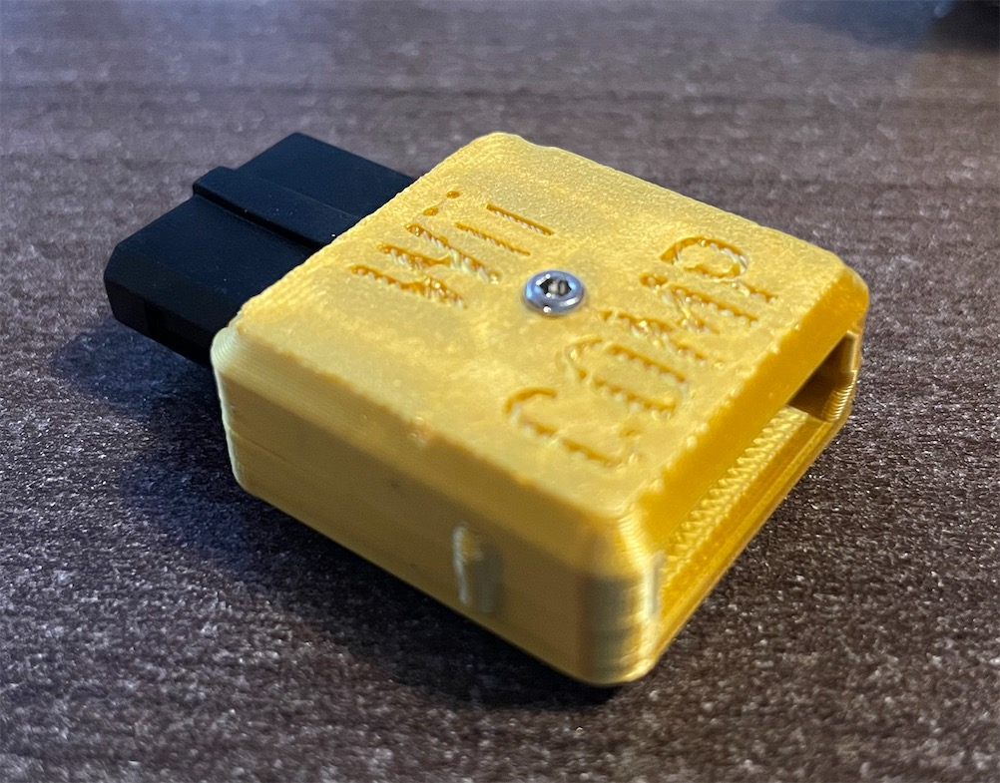 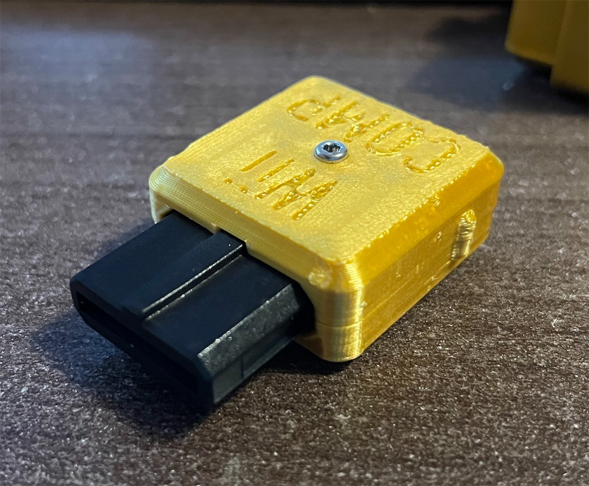 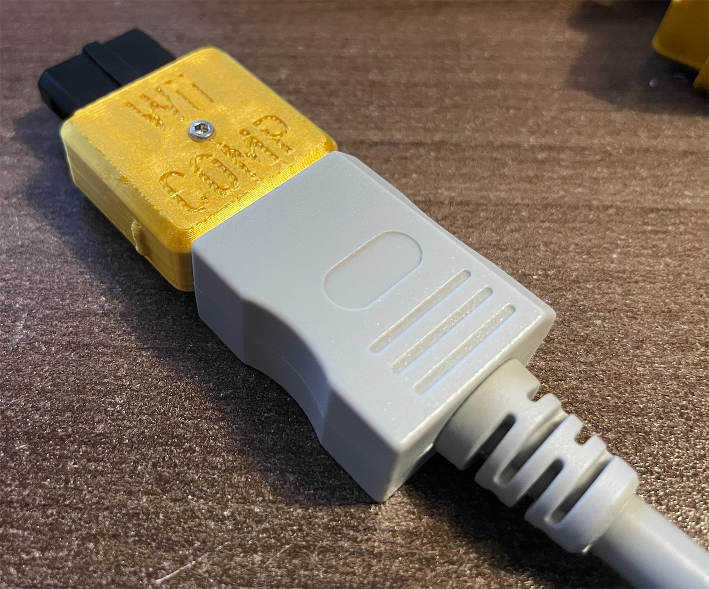

### N64Digital Dual Output

You can use this adapter in combination with my mini to full HDMI dongle to achive dual output. Details:
https://www.thingiverse.com/thing:4924766

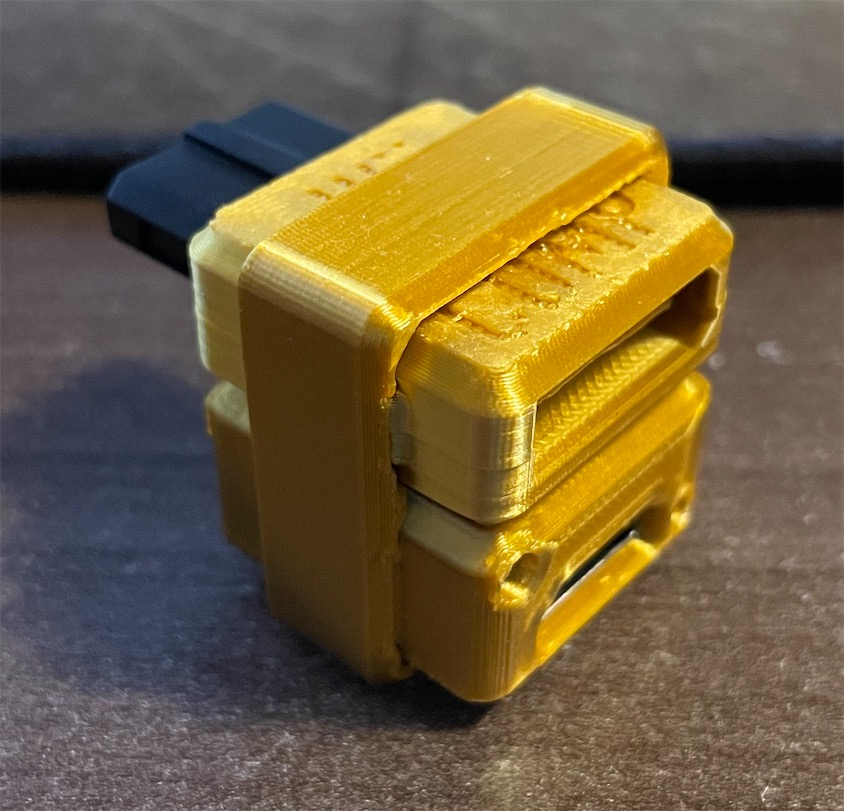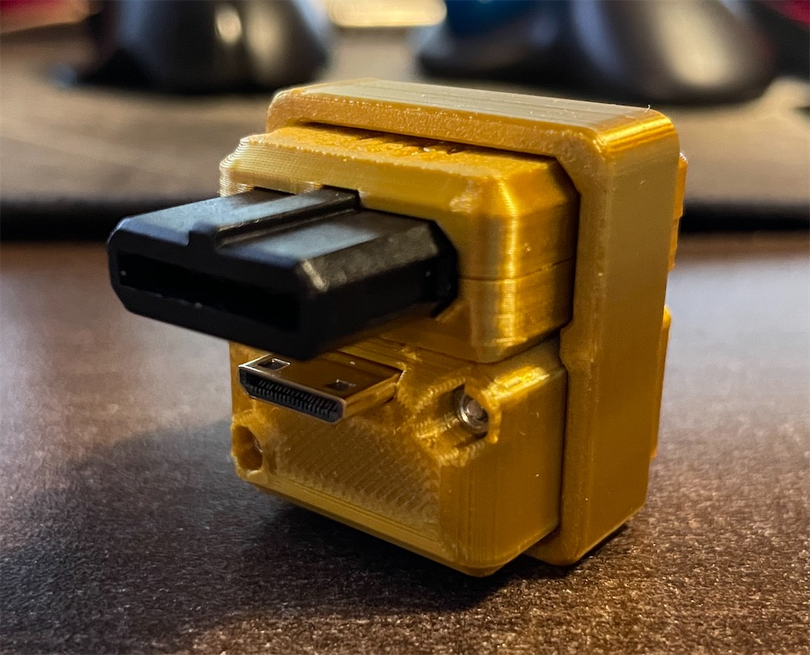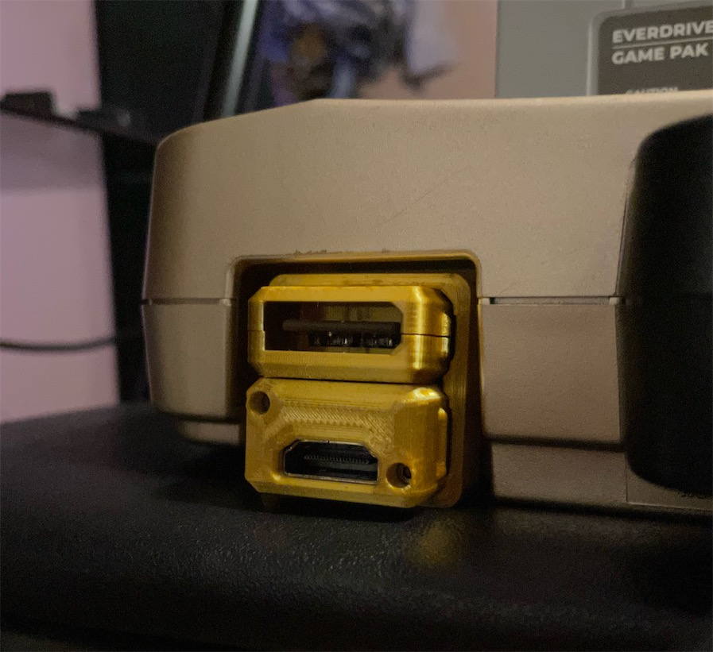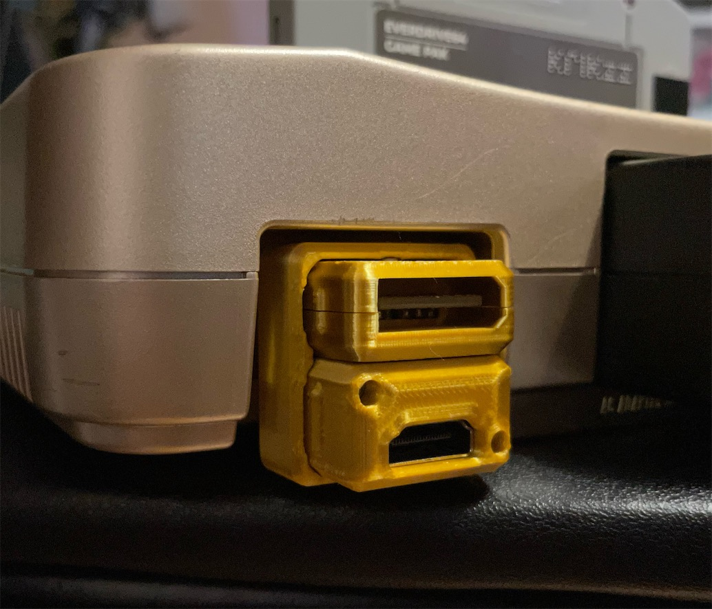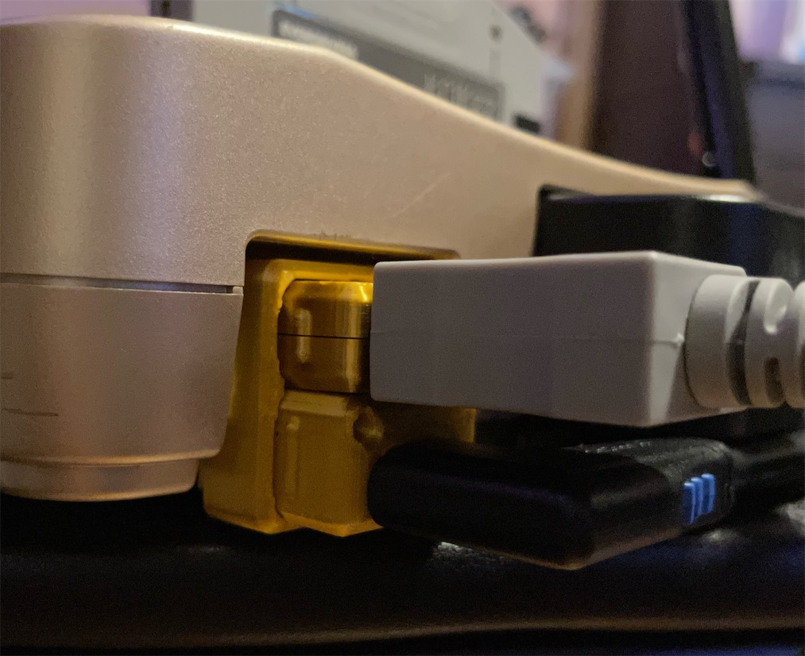

-----------

## Part

SNES Video Plug
- https://www.aliexpress.com/item/4000049107078.html

PCB
- Main: https://oshpark.com/shared_projects/2VKueJ8L
- Sub: https://oshpark.com/shared_projects/sq9awzi0

Screw and nut
- M2x12mm (total length 13.8mm) screw and hex nut: https://www.amazon.com/gp/product/B014OO5KQG

-----------

## Print

Print the parts upside down for accurate port dimensions.
If you prefer better exterior look, print upright with a raft to minimize height error.

The ring is for joining this adapter together with the mini HDMI to full HDMI adapter for the N64Digital, for better mechanical rigidity. It should also help even if the HDMI adapter is not in place, so the adapter can't sag and damage anything.
https://www.thingiverse.com/thing:4924766

-----------
## Before Assembly

File the Wii end of the PCB that goes into the component cable, so it has a chamfer on both the top and bottom side of the board. This is to ensure it doesn't damage or destroy the contacts inside your Wii component cable.
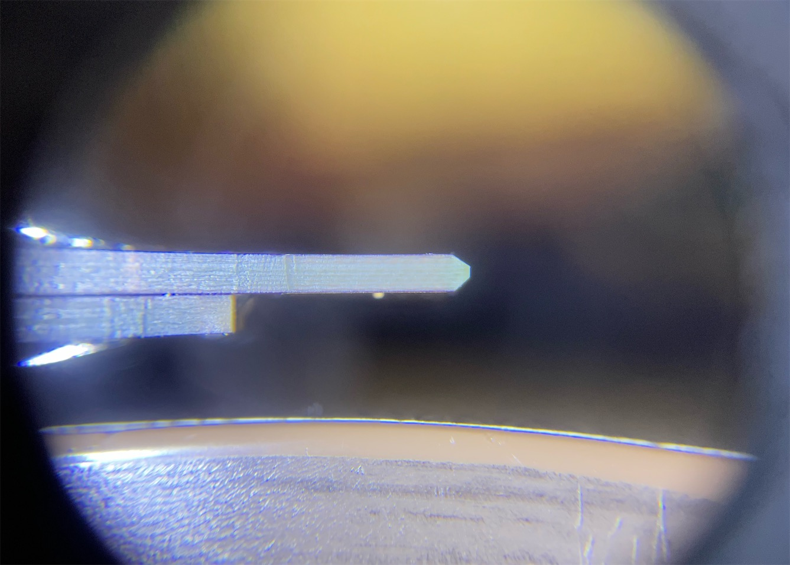
Please note the white line near the end of the golden fingers. It is recommended you file the edge all the way down to the line at 45 degrees.
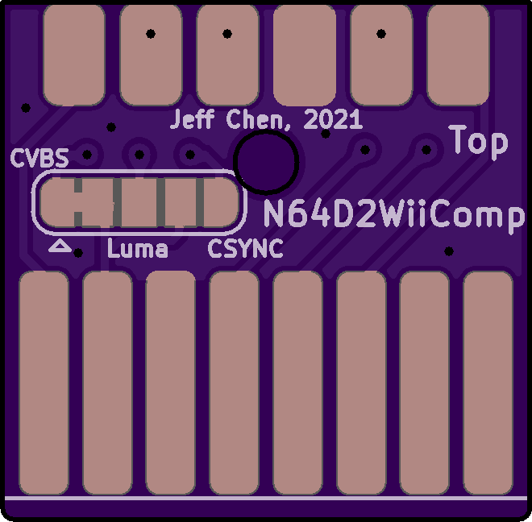

-----------

## Assembly

Solder the two PCBs toghether. Note the "This should NOT be visible" silkscreen print and obey. Then solder the SNES header onto the PCB assembly. Note the "Top" print. This indicates the way the notch on the plug should face.

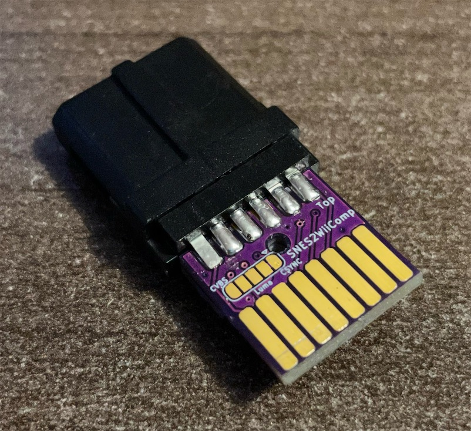

Place the soldered assembly into the printed shell and screw them together.

----------
## Misc

The composite signal is also connected by default. You can use a composite video cable for the Wii for composite video output.

It is possible to sever the default jumper on the PCB and then bridge Luma or CSync for connecting an RGBs cable.

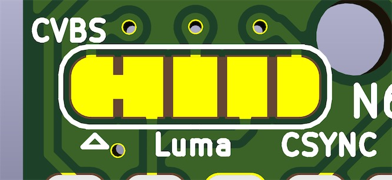
